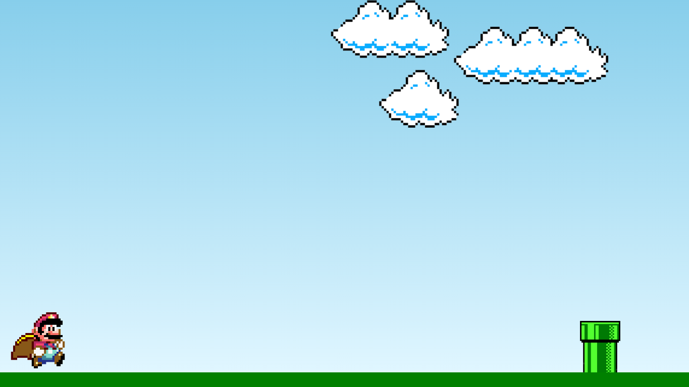

<h1 align="center">
  Super Mario 🎮 
</h1>

 

 

## 🚀 Tecnologias

Esse projeto foi desenvolvido com as seguintes tecnologias:

- HTML
- CSS
- JavaScript
## 🔗 Links

 
 
 
 
 
   💻 Autor 
<table>
  <tr>
    <td align="center">
      <a href="https://github.com/Rafaelbonfatti">
         
        
          <b>Rafael Bonfatti</b>
        
      </a>
    </td>
  </tr>
</table>

-----

  <h3 align="center"> Developed by <a href="https://www.linkedin.com/in/rafael-cantieri/">Rafael Bonfatti</a> ☕</h3>